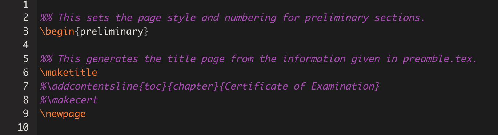
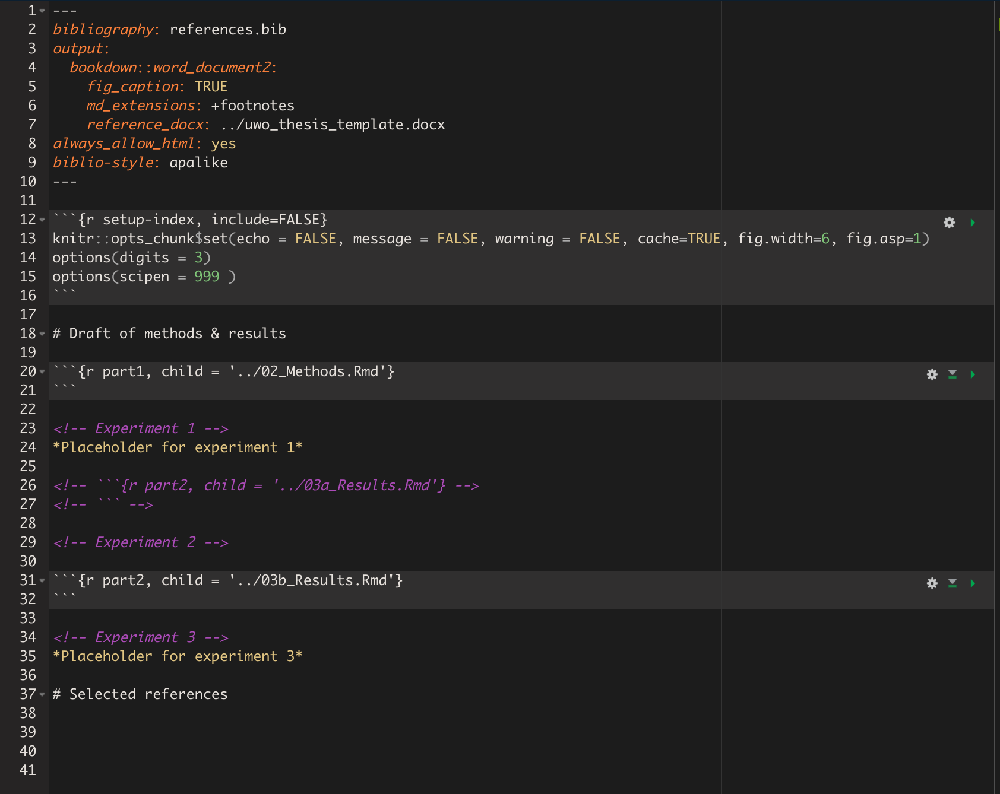

# Methods

## Getting organized: Directory structure
*A suggestion based on the advice of several clever people I have copied:*


In this example...

**dissertation** contains your individual RMarkdown files that contain the bulk of the text of the dissertation. 

- `index.Rmd`: Contains your YAML that will tell bookdown how to render your book

- `.Rmd` files that comprise the body of your book. These can be specific chapters, but can also be constructed modularly in whatever way you choose. 
  - Unless specifically told otherwise, bookdown will compile these in *alphanumeric order*, so they should be named in the order you want them to appear. 
  - In a nutshell, file names should be **machine readable, human readable, and play well with default ordering** [(thank you, Jenny Bryan)](https://speakerdeck.com/jennybc/how-to-name-files).
  - The names of the files themselves don't appear anywhere in the final document. For that, you need to use headers within the body of the .Rmd documents
- `references.bib` is a bib file containing your references. Most popular reference management tools have the option to export your references to a .bib file.
- `parameters` contains the files necessary to tell `bookdown` how to render your final document. 
  - If you are compiling to a **PDF**, it needs 2 .tex (Latex) files: `doc_preface.tex`, which contains the "front matter" of your dissertation (acknowledgements, etc), and `params.tex`, which contains the Latex parameters required to compile
  - If you are compiling to a **Word document**, it needs a template file. This could technically just be a blank document. The important thing is that it has been saved with the Word styles you want to employ in your final .docx output.
  
**data** contains any raw data files (.csv, .xlsx, etc.). Ideally, these don't get touched after you put them here, because any further manipulation will be done using .R scripts (which will make it easier to track your changes to the data)

**scripts** contains any helper scripts you used along the way (e.g., for your analysis)

**More resources:**

- [Software Carpentry's guide on project management in R Studio](https://swcarpentry.github.io/r-novice-gapminder/02-project-intro/)
- [Angela Li's thread on thesis structuring](https://twitter.com/CivicAngela/status/1024469727274565633)


## Writing a chapter {#chapter-writing}

We will now create a single chapter in RMarkdown.

There is a *lite* and a *heavy duty* version of this. 

The lite version will help us learn:

- the minimal components of a `bookdown` chapter

**Go to the lite version in exercise 2 in Section \@ref(ex2)**

The heavy-duty version will help us learn how to incorporate:

- data
- helper .R script
- citations
- figures/tables

**Go to the heavy-duty version in exercise 3 in Section \@ref(ex3)**

## Making a book!

*This section is heavily informed by Lucy's beautiful [blog post](https://livefreeordichotomize.com/2018/09/14/one-year-to-dissertate/) and accompanying [toolkit](https://github.com/LucyMcGowan/dissertation-toolkit).*

Now that we have the bare bones of a dissertation, we can compile it for the first time. 

**Go to exercise 4 in Section \@ref(ex4)**

Recall that, for this method, the **essential ingredients** are:

- your .Rmd files (chapters)
- index.Rmd

**Optional ingredients:**

- references.bib
- templates

### The workhorses
The files that will do the heavy lifting in order for your dissertation to compile as a PDF are: 

- `index.Rmd` contains the YAML[^yaml]
- `params.tex`
- `preamble.tex`

[^yaml]: [YAML](https://en.wikipedia.org/wiki/YAML) (rhymes with camel): The frontmatter/metadata that tells R Markdown how to generate your document. Indentation and spacing are **very important**. Stands for "YAML Ain't Markup Language" or, less meta, "Yet Another Multicolumn Layout." 


**`index.Rmd`**


This contains a lot of info.  You can specify different options for each output type you plan to compile. Since we'll be compiling to PDF (`pdf_book`), let's take a closer look at that section:

```
output:
  bookdown::pdf_book:
    toc: no
    template: null
    latex_engine: xelatex
    keep_tex: yes
    includes:
      in_header: templates/preamble.tex
      before_body: templates/doc_preface.tex
```

Importantly, we are pointing to the two other workhorses necessary for the PDF output: the .tex files. Note that these are adapted from people who know a lot more about LaTeX than I do; I changed very little, and mostly just moved stuff around. In their current form, they will output a document that adheres to the current Western thesis standards[^other-uni-tex].

[^other-uni-tex]: The [`thesisdown package readme`](https://github.com/ismayc/thesisdown) has a nice list of other templates that people have adapted for their universities if you'd like to compare other .tex input files.

- The `in_header` line tells bookdown to incorporate everything in `preamble.tex`. If you're familiar with LaTex, this is everything that comes before `\begin{document}`. This also contains important info like your name, department, thesis title, etc...

**preamble.tex**


- The `before_body` line points to `doc_preface.tex` which contains all the pre-body text including the abstract, acknowledgements, table of contents, etc


**doc_preface.tex**



### Ready, set, render!

To compile your dissertation for the first time, enter the following code in the console:

```
bookdown::render_book("index.Rmd", "bookdown::pdf_book")
```

Note that here we are specifying the `pdf_book` output format, but we don't actually have to since it happens to be the first, and therefore default, output format specified in our YAML. We could just as successfully run `bookdown::render_book("index.Rmd")`.

If all goes according to plan, you will see a smattering of new folders and files.
Your shiny new book can be found in `_book/_main.pdf`

If things did *not* go according to plan, you will get an error and a request that you delete `_main.Rmd` before recompiling. `_main.Rmd` is a document that's created in the process, but gets deleted when the final output has successfully compiled. It can often give you hints as to what went wrong (the lines where it got tripped up will be echoed in the error message). As instructed, you must delete it before you try to render again.

**Other things to know**

- This is the "Merge-and-Knit" approach. See Yihui's explanation of other rendering approaches [here](https://bookdown.org/yihui/bookdown/new-session.html).
- Yihui also recommends not rendering the full PDF that often, as it can be very time consuming when the output is large, and you run the risk of getting caught up with typesetting queries that are best left to the end. 
There is a way to [preview individual chapters](https://bookdown.org/yihui/bookdown/some-tips.html) that Yihui has included in bookdown, but I will also discuss my own preview methods later on.
- If you choose to use the LaTeX nomenclature package to handle abbreviations, you need to do some additional work to get the abbreviations to show up the first time. I recommend scrolling to this section in [Lucy's blog post](https://livefreeordichotomize.com/2018/09/14/one-year-to-dissertate/)
- Chapter headers (Chapter 1, Chapter 2, etc) are inserted when you use a first level header, e.g. `# Header 1`. Subsections within a chapter are assigned based on the subheaders you use (e.g., `## Header 2`, `### Header 3`...)


### Intermediary stages
I like to do a full rendering of my PDF anytime I make major changes, just to make sure everything still works so as to avoid major errors along the way.

In the interim, I have a couple of different methods for viewing my work. These are some suggestions:

- **Bookmark an .html version of your most recent version for quick and easy viewing:** Every day, I compile a `gitbook` version of my dissertation. This outputs an HTML file that can be viewed in a web browser. I've saved this page to my Chrome bookmarks so I can easily glance at the most recent version whenever I want. 

- **Keep a bookdown project of notes that can also be bookmarked and easily viewed:** I also have another bookdown project that I update regularly called my dissertation "roadmap", and which is also bookmarked for easy access. I use this "book" as a collection of notes to myself (mainly changes to my methodology, issues I've run into with compiling, etc...). I also used it to cut my teeth on while getting used to bookdown, before actually compiling the bones of my dissertation for the first time.

- **Knit individual chapters in isolation:** You can knit individual .Rmd files to see how images show up, how the text looks, etc. I like to knit to HTML on a very regular basis because it's a) fast and b) shows up immediately in my Viewer pane in RStudio. I also will occasionally knit individual chapters as Word documents to see how they will show up when I send them to my supervisor for edits (see below), and to keep track of things that aren't playing nice with Word. 

- **Use child documents to knit partial previews of the dissertation to send to your supervisor/committee:** My supervisor does not need to see my entire dissertation document every time I add a section. It is much kinder and realistic to send individual chapters or sections to him. Furthermore, he likes to receive things in .docx format so he can used tracked changes to add suggestions. After much hemming and hawing, I have settled on a workflow for this that I am happy with, though it is by no means the best option for everyone. See the next Section \@ref(previews).

## Previews and collaborations {#previews}

One of the reasons I have fallen so completely in love with RMarkdown is it lets me putter away in my ideal workflow (do stuff in R, integrate directly in document, have full control over style parameters), AND honour my supervisor's desire to receive .docx documents.

While my final output will be rendered as a PDF, and my interim document will be rendered as HTML, the drafts that get sent to my supervisor must be in Word. 

As previously mentioned, bookdown specifically has a function to render previews. You can read more about that [here](https://bookdown.org/yihui/bookdown/preview-a-chapter.html).

I strayed away from this option because sometimes I found myself wanting to send my supervisor multiple parts of my dissertation at once (e.g., part of the methods, part of the results). To do this, I have the following protocol in place:

- Subdirectory called `previews` that contains one file: `render_preview.Rmd`
- `render_preview` contains:
  - minimal YAML required to output a legible .docx file
  - minimal setup chunk identical to what I have in `index.Rmd`
  - chunks that call [child documents](https://yihui.name/knitr/demo/child/); a way to input specific .Rmd files as-is into a main .Rmd "parent" document (in this case, `render_previews.Rmd` is the parent)

**render_preview.Rmd**



**Sending a draft preview**

- When I'm ready to send a partial draft to my supervisor, I input the relevant child documents and knit `render_previews.Rmd`. I then name it something useful and send it to him. 
- He may mark it up and send it back to me with tracked changes
- I then incorporate these tracked changes *by hand* into my RMarkdown files.
  - Note: this is a highly controversial topic! We have currently hit a happy medium where I am okay doing this (it gives me the opportunity to more carefully review the changes I think), and he has allowed me to send drafts without tracked changes back.
  - NOT ALL COLLABORATORS WILL BE THIS FLEXIBLE. Some want to see the tracked changes sent back to them too. This gets tricky with RMarkdown, and has been the centre of several debates.
  - Some semi-solutions you may wish to explore:


<blockquote class="twitter-tweet" data-lang="en"><p lang="en" dir="ltr">Well this is potentially extremely exciting. Two way word &lt;-&gt; rmd street, including tracked changes integration. Will be watching this one 👀 <a href="https://t.co/7hcqolbBFQ">https://t.co/7hcqolbBFQ</a></p>&mdash; Thea Knowles (@theaknowles) <a href="https://twitter.com/theaknowles/status/1069237398674931714?ref_src=twsrc%5Etfw">December 2, 2018</a></blockquote>
<script async src="https://platform.twitter.com/widgets.js" charset="utf-8"></script>


<blockquote class="twitter-tweet" data-lang="en"><p lang="en" dir="ltr">TIL There is a way to compare diffs between 2 .docx files<br><br>Implications for Rmd workflows with collaborators/supervisors using Word: Use the revised .docx version to guide changes in your .Rmd, then compare new output with the original to dbl check<br><br>👍 <a href="https://t.co/A2EtEpFxbm">https://t.co/A2EtEpFxbm</a> <a href="https://t.co/dnWDjCXLxn">pic.twitter.com/dnWDjCXLxn</a></p>&mdash; Thea Knowles (@theaknowles) <a href="https://twitter.com/theaknowles/status/1096423010117083136?ref_src=twsrc%5Etfw">February 15, 2019</a></blockquote>
<script async src="https://platform.twitter.com/widgets.js" charset="utf-8"></script>


### 5. The nitty gritty
In descending order of messiness (i.e., how confused I get[^2])

[2^]: Some of my confusion may be because I haven't had to try hard to figure it out yet, and not necessarily related to the actual detail itself

- Reference management + citations
- Notes to self within text
- Snippets! `r emo::ji("two_hearts")`
- Predefined functions
- Footnotes
- Cross-referencing sections/figs/tables
- Figure/table autonumbering
- Tables in RMarkdown
  - Specifically when working with both .docx and .pdf
- Appendices


## Let's start dissertating with a .docx output

### Template
- Western has a .docx thesis template. This includes detailed descriptions of what should go in the final document, but importantly for our purposes here, all we need are the *styles* specified within this document.
  - This could technically just be a blank document. We use it to tell RMarkdown[^3] how to style the final output in Word
  - See also `custom_template.docx` from previous [RMarkdown workshop](LINK) to see what I mean
  
[^3]: Well, really to tell RMarkdown what to tell Pandoc...


## Other resources
- Other Rmd + bookdown resources

```{r, echo = FALSE, message = FALSE, warning = FALSE}
knitr::opts_chunk$set(echo = FALSE, message = FALSE, warning = FALSE, fig.width = 6)
```

## Dissertating in Bookdown
### Essential ingredients
- `index.Rmd`: Contains your YAML that will tell bookdown how to render your book
- `.Rmd` files that comprise the body of your book. These can be specific chapters, but can also be constructed modularly in whatever way you choose. 
  - Unless specifically told otherwise, bookdown will compile these in *alphanumeric order*, so they should be named in the order you want them to appear. 
    - In a nutshell, file names should be **machine readable, human readable, and play well with default ordering** [(thank you, Jenny Bryan)](https://speakerdeck.com/jennybc/how-to-name-files).

  
### Non-essential but very helpful ingredients

- A `.bib` file contianing your references
- Separate directories containing your:
  - data (raw .csv files, etc)
  - scripts (helper `.R` scripts that contain the bulk work of your analyses)
  - images that are not created in R
- **Template documents** that will provide bookdown with the information it needs to style your document
  - **Word**: `uwo_thesis_template.docx` is a Word document containing the style settings required to output a Western-approved thesis. This template also contains text, but really all you need is a Word document with the style elements set that you wish to use
  - **PDF**: The `tex` folder contains two `.tex` files that use Latex to create a final PDF:
    - `params.tex` contains the Latex parameters required to compile the document
    - `doc_preface.tex` contains the *front matter*: everything that will appear before the beginning of the thesis
    
*A note on the .tex documents:* The documents provided here are comprised of a mash-up of two extremely useful resources:

- [Lucy D'Agostino McGowan's blogpost and dissertation toolkit](https://livefreeordichotomize.com/2018/09/14/one-year-to-dissertate/) provided the original versions of these documents and a super handy walkthrough on how to use them.
- [Jon Clau's updated Western .tex templates](https://github.com/jclauneuro/thesis_template) contain the information necessary to produce a Western U thesis (the files hosted on [Western's site](https://grad.uwo.ca/academics/thesis/formatting.html) are older versions)

### Rendering the book

Once you have more than one `.Rmd` file, you are ready to render/compile them into a fully combined document.


The rendered version will appear in `_book/`

To render the book as whatever is listed as the default in `index.Rmd`, do:

```
bookdown::render_book("index.Rmd")
```

To render as a pdf or word document, do:

```
bookdown::render_book("index.Rmd", output_format = "pdf_book")
bookdown::render_book("index.Rmd", output_format = "word_document2")
```

A nice way to preview it is to render it as a gitbook:
```
bookdown::render_book("index.Rmd", "bookdown::gitbook")
```
Then open index.html in your browser, and run `bookdown::serve_site()` to update it whenever you save changes. This is much neater/navigable. 

Beware of features that will only show up in pdf rendering (like certain features of kable, kableExtra), or that won't compile for pdfs (like the emo package)
