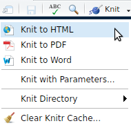

# Exercises

## Exercise 1. Getting started with RMarkdown {#ex1}

**Make an R Project**

[R Projects](https://support.rstudio.com/hc/en-us/articles/200526207-Using-Projects) make project management really simple. For every new project you embark on, creating a new .RProj file. 
Open that .RProj file whenver you're ready to work on that project, and it will: 

- Give you easy access to the directory structure (no need to define a working directory)
- Restore your last RStudio session from that project (no need to reopen files)
- Give you access to your R history from your last session
- *NB: these preferences can all be tweaked*


- Follow the prompts to create a project in a new directory for this workshop

**Make a new .Rmd file**


These are the components of your RMarkdown file:


We won't go into this in *too* much detail

**Knit your document**



Try it as a...

- Word document
- Html document
- PDF document

**More resources**

- [RStudio intro to RMarkdown](https://rmarkdown.rstudio.com/lesson-1.html)
- R-Ladies #LdnOnt presentations
  - [Intro to RMarkdown](https://github.com/rladies/meetup-presentations_london_ontario/tree/master/2017-03-04_Intro2RMarkdown)
  - [RMarkdown for summary reports and journal articles](https://github.com/rladies/meetup-presentations_london_ontario/tree/master/2018-03-06_rmarkdown) (also see more specific resources on the last slide)
  
Back to Section \@ref(crashcourse)


## Exercise 2. What's in a chapter? Lite version {#ex2}
Open `01_Intro.Rmd` and do the following:

- Write some text
- Insert an R chunk that contains some simple R code
- Knit to HTML

E.g., 

```{r echo=TRUE}
x = 3
x^2
```

Back to Section \@ref(chapter-writing)

## Exercise 3. What's in a chapter? Heavy-duty version {#ex3}

Open `03a_Results.Rmd` and find examples of: 

- sourcing a helper file (`helper.R`)
- citing references
- generating images and tables from the imported data
- cross-referencing those figures and tables
- using inline R code to refer to values from the data (like p-values, etc) so there's never a need to copy/paste


Open `../scripts/helper.R` to see what it contains.

Open `03b_Results.Rmd` and do any of the following:

- source `helper.R`
- write some text
- cite another source
- make a figure or a table
- Knit the document as an HTML file

Back to Section \@ref(chapter-writing)


## Exercise 4. Render the book! {#ex4}

Render your book by running

```
bookdown::render_book("index.Rmd", "bookdown::pdf_book")
```

At this point you can also see what the other formats look like:

```
bookdown::render_book("index.Rmd", "bookdown::word_document2")
bookdown::render_book("index.Rmd", "bookdown::gitbook")
```

**How are the different outputs called?**

- How do they differ? 
- Where do they live?


**Errors**

If you were able to compile without difficulties, try to create an error to see what it will look like when you try to compile. Some examples of errors I have easily and repeatedly encountered throughout this process are: 

- having two R chunks with the same name (e.g., I often have a chunk named `setup` at the beginnings of some of my .Rmd documents. I have taken to calling these `setup-intro`, `setup-method` etc. when I need to have them but don't want them to cause errors.)
- running into an error somewhere in the R script (did I try to call a variable that didn't exist? Forget to load a package? How many ways are there to err in R, oh let me count the ways...)

*Solving errors* is really a case-by-case quest. I try to first see what hints are in the error message (is it an .Rmd issue? A Latex issue? An R issue?) and usually resort to googling the error[^google-it]. 

[^google-it]: Joy be it that "Googling the error message" is now an [R package](https://github.com/coatless/searcher).

**More resources:**
- [Getting started with bookdown](https://bookdown.org/yihui/bookdown/get-started.html)


## 4. Explore .tex files
## 5. Bookdown to .pdf
## 7. Add figure
## 9. Add table
## 10. Edit refs
## 11. Report stats
## 12. Customize snippets


